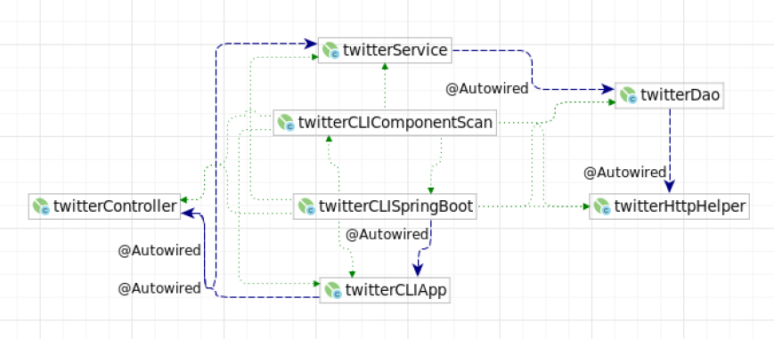

# Introduction

This application is a practice project before jumping into developing a trading platform. It is a spring framework Java app that is used to post, show, or delete twit on Twitter through the command line.

# Quick Start

- General usage

```bash
TwitterApp post|show|delete [options]
```

- Post

```bash
TwitterApp post "tweet_text" "latitude:longitude"
```

- Show

```bash
TwitterApp show "tweet_id" "field1,fields2"
```

- Delete

```bash
TwitterApp delete "id1,id2,.."
```

# Design

## UML diagram



## TwitterCLIApp

As a component that depends on Controller, this app runs from this class.

## Twitter Controller

A Controller has a dependency on service, interacts with and parsers user input (CLI args in this APP).

## Service

A Service handles business logic and calls the DAO layer in order to interact with the underlying storage/service which is the Twitter REST API in this app.

## TwitterDAO

A DAO layer depends on HttpHelper, as HttpHelper helps create OATH connections to Twitter, and the DAO layer creates, shows and deletes tweets.

## Models

Models are implemented with POJOs which is a class with private member variables and public getters and setters. In this application, we use Data Transfer Model (or DTO) and a Data access model (or domain model).

## Spring

In this app, we used Spring Framework to manage dependencies. `TwitterCLIApp` depends on `TwitterController` depends on `TwitterService` depends on `TwitterDao` depends on `TwitterHttpHelper`, we create an IOC container which is the `TwitterCLIComponentScan`, to configure and connect all the beams together. We would also define which one is the Controller, Service, Repository and Components as well.

# Test

We use Junit to test TwitterController, TwitterDao and TwitterService. This is to check if those classes can run functionally, then we use MockitoJUnit to check if it works under mocking the actual environment.

## Deployment (In-testing)

Dockerize the app.

# Improvements

- Add UPDATE methods for this app in order to fulfill CRUD manipulations.

- By adding user inputs, we could make it easier for users to understand the options. For example, the user would need only to enter post, show, and delete, and we would prompt them with the options they need to input.