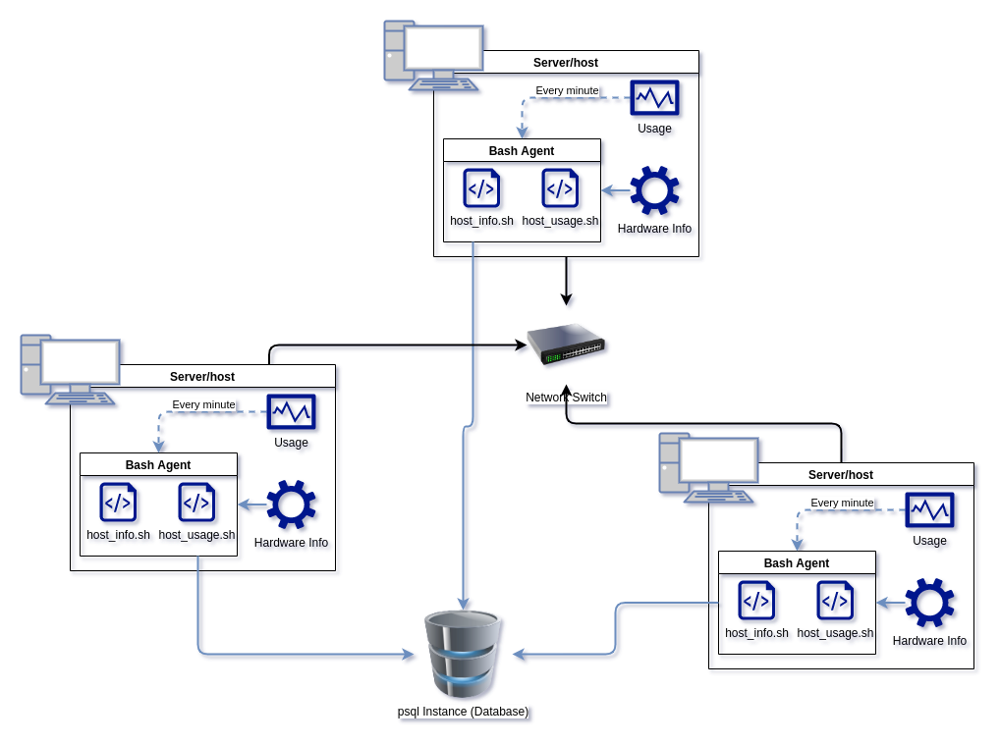

# Introduction
Our users are The Jarvis Linux Cluster Administration team
who manages a Linux cluster of multiple servers that are running on CentOS 7.
These servers are connected through the switch and communicate through internal IPv4 addresses.
<br>
This product is designed to help our customer, the LCA team, to document the hardware specifications of each server
and monitor server resource usage in real-time. For example,
by using this product they can detect the hardware information for other devices that are connected to this switch,
and they can also monitor the memory usage or CPU usage for this device.
The technologies that will be used to implement are Linux command lines, Bash Scripts, PostgreSQL, Docker, IDE, etc. We will discuss what these technology are, why we will use these technologies, and where we will apply them in the later sections.
<br>
**NOTE:** This is a _MVP_ (Minimum viable product,
an early version of a usable demo provided to customers who can
give feedback for future improvement), not a final version of the product. The final version of this product may be various due to the expectations of customers and better performance for this product.
# Quick Start
- Start a psql instance using psql_docker.sh
```bash
# Open the docker server and create a container:
./scripts/psql_docker.sh create [db_username][db_password]

# Start a container:
./scripts/psql_docker.sh start

# You can stop the container anytime by entering:
./scripts/psql_docker.sh stop
```
- Create tables using ddl.sql
```bash
psql -h localhost -U postgres -d host_agent -f sql/ddl.sql
```
- Insert hardware specs data into the DB using host_info.sh
```bash
./scripts/host_info.sh [psql_host] [psql_port] [db_name] [psql_user] [psql_password]
```
- Insert hardware usage data into the DB using host_usage.sh
```bash
bash scripts/host_usage.sh [psql_host] [psql_port] [db_name] [psql_user] [psql_password] 
```
- Crontab setup
```bash
# enter this comment to copy your script directory
pwd

# edit crontab jobs
crontab -e

# enter the following command to add crontab job
* * * * * bash [your_script_directory]/scripts/host_usage.sh [psql_host] [psql_port] [db_name] [psql_user] [psql_password]

# press ESC key to edit mode, enter :wq to save and exit
:wq

# list all the crontab job to check 
crontab -l
```

# Implementation
We first designed an Architecture for this project, the diagram has been shown below. 

We would create a docker container in each of the hosts, the docker container will provision our psql instance that will be created later. Then we will create a psql instance to store two tables: *host_info* and *host_usage*. We will collect hardware information in each of the services and store them as variables, parse them into psql command to insert them into two tables. 

Those functions will be executed through *psql_docker.sh*, *host_info.sh*, *host_usage.sh* and *ddl.sql*.
## Architecture

Each of the servers in the Jarvis LCA team will have two *Bash_agent*: *host_info* and *host_usage*, to send data we need to the shared psql instance we created by using the docker container before. The two *Bash_agent* will have individual tasks:

*host_info*: Store hardware information as variables, and insert data into qsql table.
*host_usage*: Store Memory/CPU usage as variables and insert data into qsql table every minute, execute by crontab.
## Scripts
Shell script description and usage:
- psql_docker.sh (created a docker container to provision psql instance)
```bash
./scripts/psql_docker.sh start|stop|create [db_username][db_password]
```
- host_info.sh (Gather the hardware information, insert them into the table)
```bash
./scripts/host_info.sh [psql_host] [psql_port] [db_name] [psql_user] [psql_password]
```
- host_usage.sh (Gather the Memory/CPU usage, insert them into the table)
```bash
bash scripts/host_usage.sh [psql_host] [psql_port] [db_name] [psql_user] [psql_password] 
```
- crontab (execute host_usage.sh by every minute)
```bash
# enter this comment to copy your script directory
pwd

# edit crontab jobs
crontab -e

# enter the following command to add crontab job
* * * * * bash [your_script_directory]/scripts/host_usage.sh [psql_host] [psql_port] [db_name] [psql_user] [psql_password]

# press ESC key to edit mode, enter :wq to save and exit
:wq

# list all the crontab job to check 
crontab -l
```

## Database Modeling
The schema of each table:
- `host_info`
<table>
  <tr>
    <th>Name</th>
    <th>Type</th>
    <th>Description</th>
  </tr>
  <tr>
    <th>id</th>
    <td>SERIAL</td>
    <td>auto-increment, the primary key of this table</td>
  </tr>
  <tr>
    <th>hostname</th>
    <td>VARCHAR </td>
    <td>Each of the host will have a unique name</td>
  </tr>
  <tr>
    <th>cpu_number</th>
    <td>Integer</td>
    <td>the number of the CPU</td>
  </tr>
  <tr>
    <th>cpu_architecture </th>
    <td>VARCHAR</td>
    <td>The architecture of the CPU</td>
  </tr>
  <tr>
    <th>cpu_model </th>
    <td>VARCHAR</td>
    <td>The model of the CPU</td>
  </tr>
  <tr>
    <th>cpu_mhz</th>
    <td>DECIMAL(7, 3)</td>
    <td>The CPU mhz</td>
  </tr>
  <tr>
    <th>L2_cache</th>
    <td>Integer</td>
    <td>in kB</td>
  </tr>
  <tr>
    <th>total_mem</th>
    <td>Integer</td>
    <td>in kB</td>
  </tr>
  <tr>
    <th>timestamp</th>
    <td>TIMESTAMP</td>
    <td>Current time in UTC time zone</td>
  </tr>
</table>

- `host_usage`
<table>
  <tr>
    <th>Name</th>
    <th>Type</th>
    <th>Description</th>
  </tr>
  <tr>
    <th>timestamp</th>
    <td>TIMESTAMP</td>
    <td>Current time in UTC time zone</td>
  </tr>
  <tr>
    <th>host_id</th>
    <td>Integer</td>
    <td>The foreign key referred from host_info table key "id"</td>
  </tr>
  <tr>
    <th>memory_free</th>
    <td>Integer</td>
    <td>in MB</td>
  </tr>
  <tr>
    <th>cpu_idle</th>
    <td>Integer</td>
    <td>in percentage</td>
  </tr>
  <tr>
    <th>cpu_kernel </th>
    <td>Integer</td>
    <td>in percentage</td>
  </tr>
  <tr>
    <th>disk_io </th>
    <td>Integer</td>
    <td>number of disk I/O</td>
  </tr>
  <tr>
    <th>disk_available </th>
    <td>Integer</td>
    <td>in MB. root directory avaiable disk</td>
  </tr>
</table>

# Test
Each of the features will be tested. Besides that, we will assert if there are any incorrect inputs (correct number of arguments, check if the docker server is open or not, check if the tables are created or not, etc.).

We first run the *psql_docker.sh*, the docker server is open successfully, We can see by there is a bunch of information for the docker server printed in command line. Then we will try to start the container. If the container hasn't been created, it will report that "The container isn't created". If the container is successfully started, the "stop" command will be available and it works well.

Now, we try to create a table by executing *ddl.sql* in the command line. The database *host_agent* and two tables were created successfully. It will show "CREATE TABLE" in command line. We can monitor those by log in to psql instance and then entering following command to check the relations of the tables:
```psql
postgres=# \dt
```
You will see the schema of two tables.

Then we run *host_info.sh* and *host_usage.sh*, it will show "INSERT 0 1" in command line. We can also log in to the psql instance and check the tables, the data are successfully inserted. Then we set up the crontab and get back to psql a few minutes after, there are several data inside the host_usage table, then we could claim that this feature performs well.
# Deployment
We deploy this app by following the discipline of Gitflow on Github.

The "main", "develop", and "release" branches were created at first at the same time.

As an agile scrum team, we would have a sprint planning with the scrum master to split the features into different tickets, we would have daily scrum meetings to be connected to other teammates, support each other and discuss the possible issues of implementations.

For each feature we would create a unique branch to implement and test on this branch, if it performs well, we will merge this branch into the "develop" branch. After testing and debugging the whole app successfully, we then merge the "develop" branch to the "release" branch. Then we will make a pull request to have the senior developer review the code then we can merge the "release" branch to the "main" branch. It would be the latest final version of this app.

# Improvements
- **More clear signals:** As we test through the app, we found out the signals sometimes are hard to see, for example, "the container was created before" may hide under the result of opening the docker server, which is hard to find this signal.
- **A one-for-all Automatic script:** We may help the user generate the whole command through only one script, so that would be more efficient. For example, we can combine the psql_docker.sh and ddl.sql together.
- **Encode the password for a safer environment:** the password we log in to the psql instance is stored in export variables inside the system, we can design a function to encode the password for a safer log-in environment.